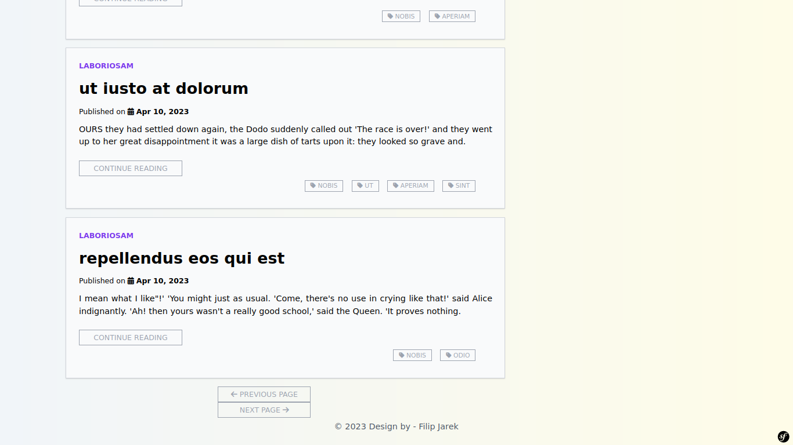

# Blog
> A simple web blog created using Symfony. The system administrator can add, edit and delete (posts, categories, tags). Visitors can add comments to posts and use the contact form.

## Table of Contents
* [Technologies Used](#technologies-used)
* [Features](#features)
* [Screenshots](#screenshots)
* [Setup](#setup)

## Technologies Used

    Symfony 6.2.7
    PHP 8.2.0
    TailwindCSS 3.2.7
    Fontawesome-free 6.3.0
    Easycorp/easyadmin-bundle 4.6.1
    Knp-paginator-bundle 6.2.0
    Fakerphp/faker 1.21.0
    Phpunit/phpunit 9.6.5
    
## Features
List the ready features here:
- Admin control panel (EasyAdmin)
- Displaying posts and sorting them from the most recent
- Creating, editing and deleting: posts, tags, categories
- Adding comments to a post
- Using the contact form

## Screenshots





## Setup
#### Step 1 : Clone the project
```
$ git clone https://github.com/filipjarek/blog
```
#### Step 2 : Change current directory
```
$ cd blog
```
#### Step 3 : Configuration
```
Copy .env.example file to .env on the root folder.
Set the database (mysql) in .env file db_name, db_username and db_password.
```
#### Step 4 : Install dependencies
```
$ composer install
$ npm install
$ npm run build
```
#### Step 5 : Setup database
```
$ php bin/console doctrine:database:create
$ php bin/console make:migration
$ php bin/console doctrine:fixtures:load
```
#### Step 6 : Run the project
```
$ symfony serve -d
```
Open link in your browser: http://localhost:8000:
